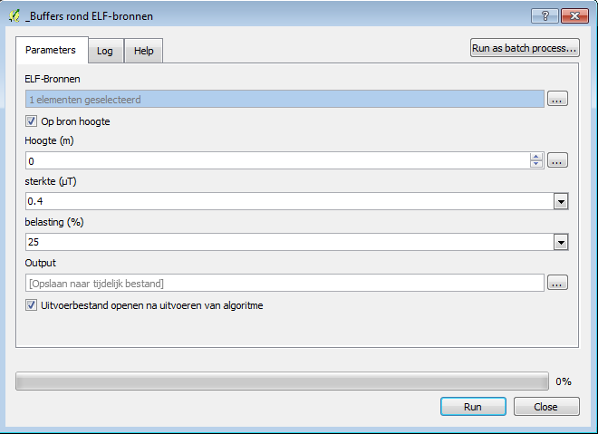

Buffers rond ELF-bronnen
====
Met dit rekenmodel worden de blootstellingscontouren rond ELF-bronnen berekend.
Dit is mogelijk voor luchtlijnen, ondergrondse kabels, cabines en transformatieposten. 
De berekening kan plaatsvinden voor een willekeurige blootstellingshoogte.

Er zijn 5 parameter die je moet invoeren:

**ELF-bronnen:** 
Voeg hier de bestanden toe van de ELF-bronnen waarvoor het magnetisch veld berekend moet worden. 
Doe dit door op de knop met de 3 puntjes te klikken en de gewenste lagen te selecteren.
Er kan geopteerd worden om het veld voor één type bron te berekenen (bijvoorbeeld enkel de luchtlijnen), maar alle types kunnen ook tegelijk uitgewerkt worden. 
Voor elk type is wel een afzonderlijk invoerbestand vereist. 
Binnen één type kan men dan nog kiezen om alle elementen van Vlaanderen mee te nemen of om zich te beperken tot bijvoorbeeld één enkele cabine.
Voor de vereiste datastructuur van deze invoerbestanden wordt verwezen naar de handleiding.

**Op bron hoogte:** 
Wanneer dit aangevinkt is, dan kan geen aparte blootstellingshoogte in het onderdeel Hoogte gedefinieerd worden. 
De blootstellingscontouren worden nu berekend op de hoogte van de bron zelf.

**Hoogte (m):** 
De blootstellingshoogte waarop de 2-dimensionale doorsnede van het 3-dimensionale B-veld moet genomen worden. 
Deze kan vrij ingegeven worden, uitgedrukt in meter, met een komma voor decimale cijfers. 
Wanneer je wilt rekenen met een variabele blootstellingshoogte die gelijk is aan de bronhoogte, selecteer dan het vakje voor “Op bron-hoogte”. 
Het veld “Hoogte” wordt op deze wijze inactief.

**Sterkte (µT):**
De minimale magnetische veldsterkte (in microTesla) dat moet gelden binnen het veld rondom de ELF-bronnen.  
Via een dropdown-menu kan er ondermeer gekozen worden tussen:
    - 0,2 ìT (richtwaarde Vlaams binnenmilieubesluit)
    - 0,3 ìT (epidemiologische afkappunt)
    - 0,4 ìT (epidemiologisch afkappunt)
    - 10 ìT (interventiewaarde Vlaams binnenmilieubesluit)

**Belasting (%):**
De stroombelasting in percentage. Deze parameter is enkel relevant voor luchtlijnen en ondergrondse kabels. 
Het drop-down menu geeft een keuzecijfer tussen 1% en 100%.

**Output:**
Naam en locatie van de resulterende feature class. Indien dit wordt opengelaten, zal een tijdelijke locatie gekozen worden.
Een tijdelijk bestanden kan nog steeds worden opgeslagen door er recht op te kliken en "Opslaan als ..." te kiezen.

Als output van deze module wordt een shapefile gecreëerd met de buffers rondom de ELF-bronnen waarbinnen de minimale ingegeven veldsterkte wordt bereikt.

