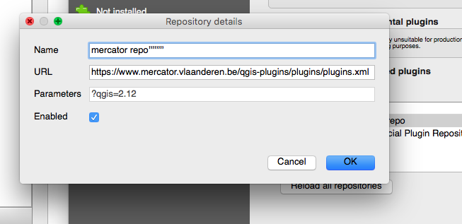
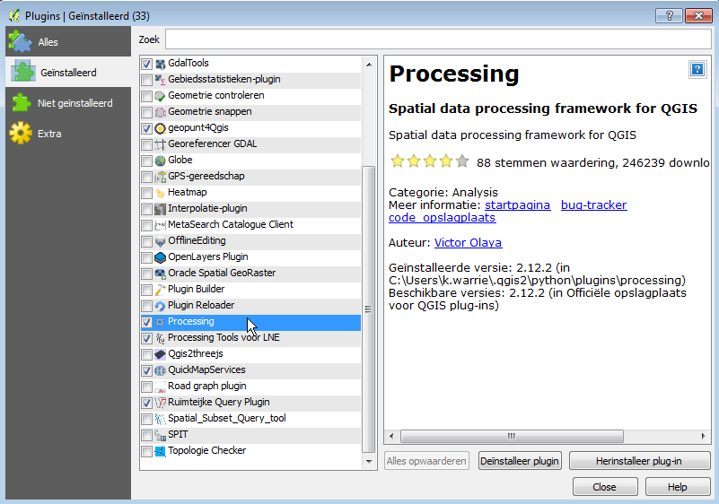
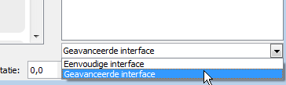

The LNE-toolbox for the QGIS processing framework
=======

Several tools ported from arcgis geoprocessing scripts to QGIS, develloped for the Flemish Environment Departement. 
As this tool is only relevant to Flemish government agencies, the rest of this file is in dutch.

De LNE-toolbox voor het QGIS processing framework
======

Dit zijn verschillende arcgis geoprocessing script geport naar een provider voor het QGIS processing framework.
Ontwikkeld voor het department Leefmilieu en Energie (LNE).

Deze tool vereist minimaal QGIS versie 2.12.

Inhoud:
- Rekenmodel voor elektromagnetische straling (ELF): 
	- [_Buffers rond ELF-bronnen](LNEtools_bufferELFbronnen.md)

Installatie
-----
Open de plugins dialoog via het menu: *Plugins > Plugins Beheren en Installeren ...*
 
De LNE-plugin blibiotheek moet zijn toevoegd. Dit kan via het tabblad 'Extra' in de plugins-dialoog.
Hier kan je de extra zoeklocatie van LNE toevoegen: https://www.mercator.vlaanderen.be/qgis-plugins/plugins/plugins.xml

Als dat het geval is kan je zoek op 'LNE' of  'processing'
Download en activeer zowel 'processing' als 'Processing Tools voor LNE'.

Open de processing dialoog en activeer de "Geavanceerde weergave" om de toolbox gemakkelijk terug te vinden.

